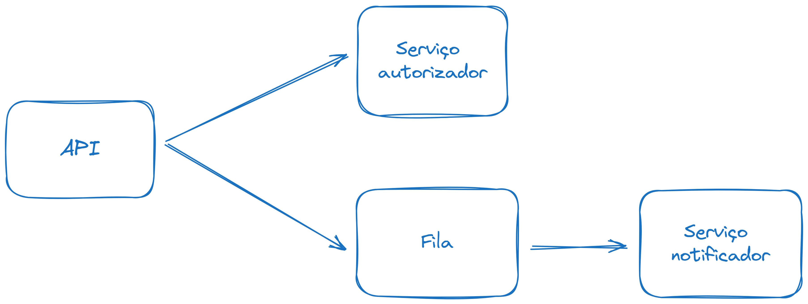

Implementação do [desafio picpay backend](https://github.com/PicPay/picpay-desafio-backend)

### Design & Arquitetura


- Arquitetura hexagonal
- DDD (Entidade de domínio, objetos de valor e repositório)
- Message queue (RabbitMQ)
- Testes de unidade e integração

### Os porquês
**Hexagonal:** isolar a aplicação dos drivers e drivens me abre possibilidade de testar as funcionalidades sem precisar bater nos recursos externos, que nesse caso são serviço autorizador, serviço notificador, banco e fila.

Claro que depende da situação, mas normalmente eu não sou adepto a ideia de abstrair o banco porque um dia, talvez, quem sabe, vai que o banco muda. Geralmente eu crio abstrações para aumentar a testabilidade. 

**DDD (Entidade de domínio, objetos de valor e repositório):** Apesar do desafio não ter tanta complexidade de regra de negócio, sempre que consigo eu gosto de sair do transaction script e ter um domínio mais rico. Uma das vantagens é que eu consigo concentrar regras de negócio num só lugar e aplicar bastante teste de unidade em cima dessas regras.

**Message queue (RabbitMQ):** O serviço autorizador é síncrono, portanto caso esteja fora do ar a transação precisa ser interrompida. 
Agora caso o serviço notificador esteja fora do ar, a transação vai ser concluida mesmo assim e a notificação entregue eventualmente.

### Tecnologias
- Spring Boot
- Spring MVC
- Spring Data JPA
- Spring AMQP
- Docker

### Como executar
A api está containerizada, então você pode rodar o projeto usando devcontainer ou usando os comandos abaixo.

Subir os containers:
```
docker compose -f .devcontainer/compose.yml up -d --build
```

Acessar o container da api:
```
docker exec -it picpay-desafio-backend-api bash
```

Rodar a aplicação:
```
mvn spring-boot:run
```